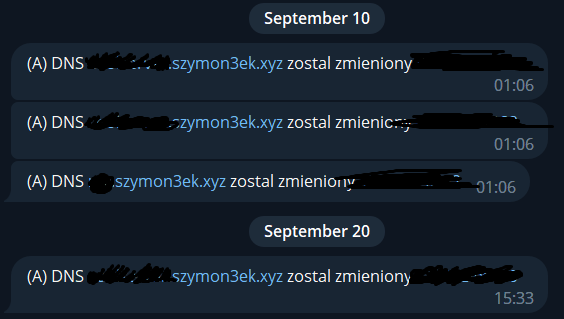

# CloudflareDDNS
Cloudflare Dynamic DNS

# How to use?
1. open cmd and write <b>npm i </b>
2. write data into config.json
3. run project (node <b>index.js</b> or if u use pm2 <b>pm2 start index.js</b>)

# Images

